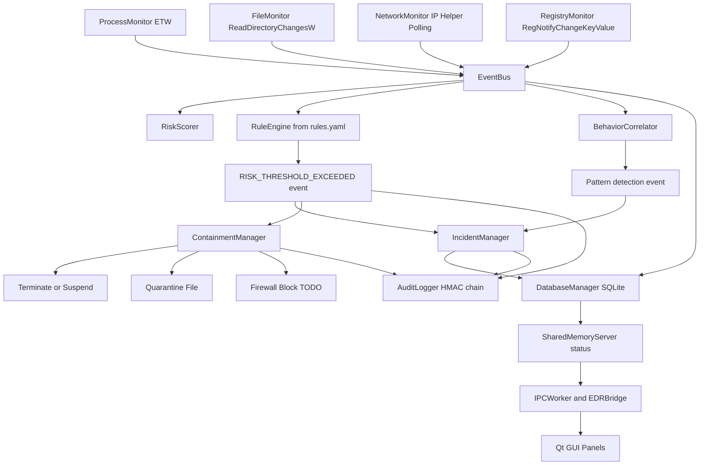

# CortexEDR Class Presentation Guide

This document explains the most important parts of the codebase and where each part is implemented so you can present the project clearly.

## 1) Big Picture: What This System Does

CortexEDR is a Windows Endpoint Detection and Response prototype built in C++20.

Core flow:
1. Collect security events from Windows (process, file, network, registry).
2. Publish events on a central event bus.
3. Analyze events using risk scoring + IOC rules + behavior correlation.
4. Trigger incident lifecycle and containment actions.
5. Persist and expose state to GUI through IPC.

Main orchestration lives in:
- `main.cpp`

## 2) File-by-File Map of Important Components

### Core Infrastructure

- Event system (pub/sub):
  - `core/EventBus.hpp`
  - `core/EventBus.cpp`
- Worker pool used for async event publishing:
  - `core/ThreadPool.hpp`
  - `core/ThreadPool.cpp`
- Logging:
  - `core/Logger.hpp`
  - `core/Logger.cpp`

### Collectors (Data Ingestion)

- Process monitoring via ETW:
  - `collectors/ProcessMonitor.hpp`
  - `collectors/ProcessMonitor.cpp`
- File monitoring via ReadDirectoryChangesW:
  - `collectors/FileMonitor.hpp`
  - `collectors/FileMonitor.cpp`
- Network monitoring via IP Helper table polling:
  - `collectors/NetworkMonitor.hpp`
  - `collectors/NetworkMonitor.cpp`
- Registry monitoring via RegNotifyChangeKeyValue:
  - `collectors/RegistryMonitor.hpp`
  - `collectors/RegistryMonitor.cpp`

### Detection and Analysis Engine

- Risk scoring:
  - `engine/RiskScorer.hpp`
  - `engine/RiskScorer.cpp`
- Rule matching engine (IOC patterns from YAML):
  - `engine/RuleEngine.hpp`
  - `engine/RuleEngine.cpp`
- Behavioral pattern correlation over per-process timelines:
  - `engine/BehaviorCorrelator.hpp`
  - `engine/BehaviorCorrelator.cpp`
- Rule configuration (hash/path/network/registry patterns):
  - `config/rules.yaml`
- Runtime configuration:
  - `config/config.yaml`

### Incident and Response

- Incident state machine and persistence hooks:
  - `response/IncidentManager.hpp`
  - `response/IncidentManager.cpp`
- Containment actions (terminate/suspend/quarantine, firewall blocking placeholder):
  - `response/ContainmentManager.hpp`
  - `response/ContainmentManager.cpp`

### Persistence, Audit, and IPC/UI

- SQLite persistence:
  - `persistence/DatabaseManager.hpp`
  - `persistence/DatabaseManager.cpp`
- Tamper-evident audit chain:
  - `compliance/AuditLogger.hpp`
  - `compliance/AuditLogger.cpp`
- Shared memory status server:
  - `ipc/SharedMemoryServer.hpp`
  - `ipc/SharedMemoryServer.cpp`
- Named pipe + shared memory clients (GUI side):
  - `ipc/PipeClient.hpp`
  - `ipc/PipeClient.cpp`
  - `ipc/SharedMemoryClient.hpp`
  - `ipc/SharedMemoryClient.cpp`
- Qt bridge between UI and backend IPC:
  - `ui/EDRBridge.hpp`
  - `ui/EDRBridge.cpp`
  - `ui/IPCWorker.hpp`
  - `ui/IPCWorker.cpp`

## 3) How Multithreading Works (Important Presentation Topic)

Threading in this codebase is explicit and modular.

### A) Collector Threads

- `ProcessMonitor` starts one ETW processing thread (`ProcessTrace` loop).
- `FileMonitor` starts one thread per watched directory.
- `NetworkMonitor` starts one polling thread.
- `RegistryMonitor` starts one thread per monitored registry key/root combination.

Why this design:
- Keeps each data source independent.
- Prevents one slow collector from blocking others.

### B) EventBus + Async Delivery

- `EventBus::Publish` is synchronous.
- `EventBus::PublishAsync` uses an internal `ThreadPool` (`InitAsyncPool(2)` in `main.cpp`).
- Subscribers are copied under lock, then invoked outside lock to reduce lock contention risk.

### C) Shared State Safety

- `RiskScorer` and `RuleEngine` use `std::shared_mutex` for read-heavy concurrency.
- `ThreadPool` uses mutex + condition variable + task queue.
- Atomic flags are used for run/stop state in monitors.

### D) GUI Threading

- `EDRBridge` starts dedicated `QThread` workers for IPC and scanning.
- Pipe callbacks are marshaled into Qt thread context using queued invocations.

## 4) Detection Pipeline Explained

### Step 1: Event Generation

Collectors publish `Event` objects with metadata such as:
- `image_path`
- `file_path`
- `remote_address`, `remote_port`
- `key_path`

### Step 2: Baseline Risk Scoring

`RiskScorer::ProcessEvent` adds heuristic points, for example:
- Temp/AppData process execution
- System directory writes
- External network connection
- Suspicious ports (4444, 1337, 6667, 31337)
- Registry persistence locations (Run/Services)

Risk is capped to 100 and mapped to levels.

### Step 3: Rule Engine (IOC Matching)

`RuleEngine` loads YAML rules from `config/rules.yaml` and checks events by rule type:
- `hash`
- `path`
- `network`
- `registry`

On a match, it emits a `RISK_THRESHOLD_EXCEEDED` event with metadata like `rule_name`, `risk_points`, and `action`.

### Step 4: Behavior Correlation

`BehaviorCorrelator` keeps per-process timelines and detects higher-level attack patterns:
- Dropper-like chain
- Persistence behavior
- Lateral movement behavior

It emits asynchronous detection events when a pattern is found.

### Step 5: Incident and Response

`IncidentManager` subscribes to risk/containment events and drives an incident state machine:
- NEW -> INVESTIGATING -> ACTIVE -> ESCALATED/CONTAINED -> CLOSED

`ContainmentManager` can terminate/suspend processes and quarantine files.

## 5) YARA Rules and Malware Signatures: What Is Actually Implemented

This is an important section to present accurately.

### What IS implemented

- A custom IOC rule engine using YAML rules (`config/rules.yaml`), not libyara.
- Signature-like matching in `RuleEngine`:
  - Hash exact matches (case-insensitive)
  - Wildcard path matches
  - Wildcard network indicator matches
  - Wildcard registry persistence matches
- Example malware hash entries exist in `rules.yaml`.

### What is NOT implemented yet

- Native YARA integration (no `libyara` dependency or YARA compilation/matching code).
- End-to-end file hash generation path feeding `event.metadata["file_hash"]` in runtime collectors is not currently visible in this codebase.

Presentation-safe phrasing:
- "The project currently uses a YARA-like IOC engine based on YAML rules. True YARA engine integration is a clear next enhancement."

## 6) Known Implementation Gaps You Can Mention Professionally

These are useful to present as "future hardening roadmap" points:

1. `RuleEngine` stores only one subscription ID but subscribes to multiple event types, so stop/unsubscribe behavior is partial.
2. Some rule patterns in `rules.yaml` expect `IP:PORT` style network matching (for example `*:4444`) while network matcher currently checks `remote_address` only.
3. Incident/containment logic depends on `risk_level` metadata in `RISK_THRESHOLD_EXCEEDED` events, but runtime producers do not consistently set it.
4. Firewall blocking in `ContainmentManager` is currently a documented TODO (COM API path not fully implemented).

These do not invalidate the architecture; they define concrete next milestones.

## 7) End-to-End Workflow Diagram (Mermaid)

## 8) 60-Second Presentation Script (Optional)

"CortexEDR is a modular, event-driven EDR prototype. Windows collectors generate telemetry and publish to a central EventBus. Three analysis layers run in parallel: heuristic risk scoring, IOC rule matching from YAML, and behavior correlation over process timelines. Detection events drive an incident state machine and optional containment actions such as process termination, suspension, and quarantine. The backend persists data in SQLite and exposes real-time status to the Qt dashboard using shared memory and pipe-based IPC. For signatures, we currently use a YARA-like custom rule model with hash/path/network/registry indicators, and true libyara integration is planned as the next step." 
