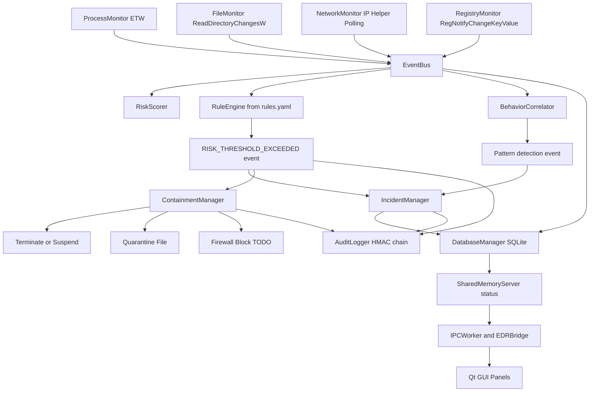

# CortexEDR Class Presentation Guide

This document explains the most important parts of the codebase and where each part is implemented so you can present the project clearly.

## 0) Quick Glossary (Simple Definitions)

- Endpoint Detection and Response (EDR): Security software that watches a computer (endpoint), detects suspicious activity, and helps respond to attacks.
- Telemetry: Raw activity data collected from the system (for example process start, file write, network connect).
- Event-driven architecture: A design where components communicate by sending events instead of directly calling each other.
- Event Bus: A central message hub where producers publish events and consumers subscribe to them.
- Publisher/Subscriber (pub/sub): Publisher sends data; subscriber receives data if it subscribed to that event type.
- Multithreading: Running multiple tasks at the same time using separate threads.
- Thread Pool: A reusable set of worker threads used to run tasks asynchronously.
- Asynchronous processing: Work that runs in the background without blocking the main flow.
- IOC (Indicator of Compromise): A known suspicious artifact such as a bad hash, path, IP, or registry key.
- Rule Engine: Component that compares incoming events with predefined detection rules.
- Malware signature: A unique pattern (hash/string/behavior) used to recognize known malicious files or activity.
- YARA: A standard malware-pattern matching technology used by many security products.
- Heuristic detection: Detecting suspicious behavior using logic/rules, not just exact known signatures.
- Behavior correlation: Combining multiple low-level events into a higher-level attack pattern.
- Containment: Defensive action to limit damage (kill process, quarantine file, block network).
- Quarantine: Move/isolate a suspicious file so it cannot run.
- Persistence (attacker persistence): Techniques malware uses to stay active after reboot (for example Run keys).
- IPC (Inter-Process Communication): How backend and GUI processes exchange data.
- ETW (Event Tracing for Windows): Windows event system used to capture runtime activity.

## 1) Big Picture: What This System Does

CortexEDR is a Windows Endpoint Detection and Response prototype built in C++20.

Definition in simple words:
- CortexEDR continuously watches system activity, scores risk, checks for known bad indicators, and helps contain threats.

Core flow:
1. Collect security events from Windows (process, file, network, registry).
2. Publish events on a central event bus.
3. Analyze events using risk scoring + IOC rules + behavior correlation.
4. Trigger incident lifecycle and containment actions.
5. Persist and expose state to GUI through IPC.

Main orchestration lives in:
- `main.cpp`

## 2) File-by-File Map of Important Components

### Core Infrastructure

Definition:
- Infrastructure here means shared building blocks used by all modules (messaging, threads, logs).

- Event system (pub/sub):
  - `core/EventBus.hpp`
  - `core/EventBus.cpp`
- Worker pool used for async event publishing:
  - `core/ThreadPool.hpp`
  - `core/ThreadPool.cpp`
- Logging:
  - `core/Logger.hpp`
  - `core/Logger.cpp`

### Collectors (Data Ingestion)

Definition:
- Collectors are listeners/sensors that gather telemetry from different parts of Windows.

- Process monitoring via ETW:
  - `collectors/ProcessMonitor.hpp`
  - `collectors/ProcessMonitor.cpp`
- File monitoring via ReadDirectoryChangesW:
  - `collectors/FileMonitor.hpp`
  - `collectors/FileMonitor.cpp`
- Network monitoring via IP Helper table polling:
  - `collectors/NetworkMonitor.hpp`
  - `collectors/NetworkMonitor.cpp`
- Registry monitoring via RegNotifyChangeKeyValue:
  - `collectors/RegistryMonitor.hpp`
  - `collectors/RegistryMonitor.cpp`

### Detection and Analysis Engine

Definition:
- This is the "brain" that decides whether an event is normal or suspicious.

- Risk scoring:
  - `engine/RiskScorer.hpp`
  - `engine/RiskScorer.cpp`
- Rule matching engine (IOC patterns from YAML):
  - `engine/RuleEngine.hpp`
  - `engine/RuleEngine.cpp`
- Behavioral pattern correlation over per-process timelines:
  - `engine/BehaviorCorrelator.hpp`
  - `engine/BehaviorCorrelator.cpp`
- Rule configuration (hash/path/network/registry patterns):
  - `config/rules.yaml`
- Runtime configuration:
  - `config/config.yaml`

### Incident and Response

Definition:
- Incident management tracks a security case from first alert to closure.
- Response means taking action to reduce impact.

- Incident state machine and persistence hooks:
  - `response/IncidentManager.hpp`
  - `response/IncidentManager.cpp`
- Containment actions (terminate/suspend/quarantine, firewall blocking placeholder):
  - `response/ContainmentManager.hpp`
  - `response/ContainmentManager.cpp`

### Persistence, Audit, and IPC/UI

Definition:
- Persistence means saving data permanently (database).
- Audit means writing trustworthy logs for investigation/compliance.
- IPC/UI means getting backend data safely into the visual dashboard.

- SQLite persistence:
  - `persistence/DatabaseManager.hpp`
  - `persistence/DatabaseManager.cpp`
- Tamper-evident audit chain:
  - `compliance/AuditLogger.hpp`
  - `compliance/AuditLogger.cpp`
- Shared memory status server:
  - `ipc/SharedMemoryServer.hpp`
  - `ipc/SharedMemoryServer.cpp`
- Named pipe + shared memory clients (GUI side):
  - `ipc/PipeClient.hpp`
  - `ipc/PipeClient.cpp`
  - `ipc/SharedMemoryClient.hpp`
  - `ipc/SharedMemoryClient.cpp`
- Qt bridge between UI and backend IPC:
  - `ui/EDRBridge.hpp`
  - `ui/EDRBridge.cpp`
  - `ui/IPCWorker.hpp`
  - `ui/IPCWorker.cpp`

## 2.5) What Code Is Written In The Important Files (Detailed Walkthrough)

This section answers: "What exactly is written in files like EventBus.cpp, ThreadPool.cpp, etc.?"

### `core/EventBus.hpp`

- Defines the global event types (`PROCESS_CREATE`, `FILE_MODIFY`, `NETWORK_CONNECT`, `RISK_THRESHOLD_EXCEEDED`, etc.).
- Defines the `Event` struct (type, timestamp, pid, process_name, metadata map).
- Declares `EventBus` API: `Subscribe`, `Unsubscribe`, `Publish`, `PublishAsync`.
- Declares async pool lifecycle methods: `InitAsyncPool()` and `ShutdownAsyncPool()`.

### `core/EventBus.cpp`

- Implements singleton pattern via `EventBus::Instance()`.
- `Subscribe(...)`: stores callback handlers per event type and returns a subscription ID.
- `Unsubscribe(id)`: removes matching callback from all event type vectors.
- `Publish(event)`: copies handlers under mutex lock, then runs handlers outside lock.
- `PublishAsync(event)`: queues publish work into internal `ThreadPool` if available.
- `InitAsyncPool(num_threads)`: allocates internal thread pool.
- `ShutdownAsyncPool()`: gracefully drains and destroys pool.

Why it matters in class:
- This is the backbone of event-driven communication between collectors and detection modules.

### `core/ThreadPool.hpp`

- Declares worker thread vector, task queue, mutex, condition variable, stop flag.
- Template `Enqueue(...)` wraps work into `std::packaged_task`, returns `std::future`.
- Prevents enqueue on stopped pool by throwing runtime error.

### `core/ThreadPool.cpp`

- Constructor starts `num_threads` worker threads.
- `WorkerThread()`: waits for tasks, pops queue item, executes task.
- `Shutdown()`: sets stop flag, wakes all workers, joins threads, clears vector.

Why it matters:
- EventBus async delivery and other background tasks run safely here.

### `collectors/ProcessMonitor.cpp`

- Enables debug privilege (`SeDebugPrivilege`) for deeper process visibility.
- Starts a real-time ETW trace session (`StartTraceW`) with process event flags.
- Opens ETW consumer (`OpenTraceW`) and runs `ProcessTrace` in monitor thread.
- Parses ETW payload fields (`pid`, `parent_pid`, session, image path).
- Publishes `PROCESS_CREATE` / `PROCESS_TERMINATE` events to EventBus.

Why it matters:
- This is the process telemetry sensor for runtime process behavior.

### `collectors/FileMonitor.cpp`

- Starts one monitoring thread per watch path.
- Uses `ReadDirectoryChangesW` in overlapped mode for async directory notifications.
- Parses `FILE_NOTIFY_INFORMATION` records and maps actions:
  - add -> `FILE_CREATE`
  - remove -> `FILE_DELETE`
  - modify/rename -> `FILE_MODIFY`
- Publishes file path + action metadata via EventBus.

Why it matters:
- Detects suspicious file writes/changes in monitored directories.

### `collectors/NetworkMonitor.cpp`

- Initializes Winsock (`WSAStartup`) and starts polling thread.
- Polls TCP table (`GetExtendedTcpTable`) and UDP table (`GetExtendedUdpTable`).
- Converts each row into normalized connection info.
- Uses a `known_connections_` set to only emit newly seen connections.
- Publishes `NETWORK_CONNECT` with local/remote IP+port and protocol metadata.

Why it matters:
- Provides network telemetry used for C2/lateral movement detection.

### `collectors/RegistryMonitor.cpp`

- Opens high-value persistence roots in HKLM/HKCU (Run, RunOnce, services-like locations).
- One thread per monitored key path.
- Uses `RegNotifyChangeKeyValue` + wait loop for registry change notifications.
- Publishes `REGISTRY_WRITE` events with changed key path metadata.

Why it matters:
- Detects common persistence changes attackers use to survive reboot.

### `engine/RiskScorer.cpp`

- Implements heuristic scoring logic based on event content:
  - process from temp/appdata -> +15
  - writes to system directories -> +15
  - external IP connect -> +10
  - suspicious ports (4444, 1337, 6667, 31337) -> +15
  - persistence registry writes -> +20
- Aggregates factor scores per PID, caps at 100.
- Maps numeric score to risk level via threshold logic.
- Uses `std::shared_mutex` for thread-safe reads/writes.

Why it matters:
- Converts raw telemetry into priority (which process needs urgent attention).

### `engine/RuleEngine.cpp`

- Loads rules from YAML (`config/rules.yaml`) using `yaml-cpp`.
- Validates each rule fields: name, type, patterns, risk points, action.
- Subscribes to relevant event types and evaluates each incoming event.
- Supports rule type matchers:
  - `MatchHashRule`
  - `MatchPathRule`
  - `MatchNetworkRule`
  - `MatchRegistryRule`
- Implements custom wildcard matcher (`*`, `?`).
- On match, emits async `RISK_THRESHOLD_EXCEEDED` event with `rule_name`, `risk_points`, and copied original metadata.

Why it matters:
- This is your signature/IOC detection engine.

### `engine/BehaviorCorrelator.cpp`

- Maintains per-process event timelines in memory.
- Removes old timeline entries based on time window.
- Pattern logic implemented as explicit sequence checks:
  - Dropper: suspicious file create -> process create -> network connect.
  - Persistence: registry persistence write -> process create.
  - Lateral movement: multiple SMB/RPC connections to distinct IPs.
- Emits detection as `INCIDENT_STATE_CHANGE` async events.

Why it matters:
- Finds attack behavior chains that single-event rules can miss.

### `response/IncidentManager.cpp`

- Subscribes to risk and containment events.
- Creates/looks up incidents per PID.
- Stores associated events, risk snapshots, state history.
- Enforces state machine transitions:
  - NEW -> INVESTIGATING -> ACTIVE -> ESCALATED/CONTAINED -> CLOSED
- Serializes incidents to JSON files and optionally to SQLite via `DatabaseManager`.
- Emits `INCIDENT_STATE_CHANGE` events on valid transitions.

Why it matters:
- Central case management logic for SOC-style incident lifecycle.

### `response/ContainmentManager.cpp`

- Subscribes to `RISK_THRESHOLD_EXCEEDED` events.
- Auto-containment logic branches by risk level metadata:
  - HIGH -> suspend process (`NtSuspendProcess`)
  - CRITICAL -> terminate process (+ optional quarantine)
- Implements manual APIs: terminate, suspend, block network, quarantine file.
- Quarantine implementation:
  - move file to quarantine directory
  - apply restrictive DACL (deny Everyone, allow SYSTEM)
- Firewall block path is scaffolded (COM API TODO).

Why it matters:
- This is the active defense layer, not just passive detection.

### `persistence/DatabaseManager.cpp`

- Opens SQLite database and creates parent directories if needed.
- Enables WAL mode for better concurrency.
- Creates tables/indexes for events, incidents, audit log.
- Prepares reusable SQL statements for insert/query/upsert.
- Serializes metadata/state arrays as JSON strings for storage.

Why it matters:
- Gives historical memory and post-incident investigation data.

### `compliance/AuditLogger.cpp`

- Subscribes to risk, incident-state, and containment events.
- Writes immutable audit entries with hash-chain fields:
  - `prev_hash`
  - `entry_hash`
- Computes entry hash via HMAC-SHA256 over deterministic entry fields.
- Supports chain integrity verification and export.

Why it matters:
- Enables tamper-evident audit trails for compliance and forensics.

### `ipc/SharedMemoryServer.cpp`

- Creates named shared memory object (`CreateFileMappingW`).
- Maps view (`MapViewOfFile`) to expose shared `SharedStatus` struct.
- `Update(...)` writes latest engine status for GUI readers.
- Ensures fixed magic/version markers for structure validation.

Why it matters:
- Provides low-latency backend status to dashboard/UI.

### `config/rules.yaml`

- Declares detection rules in categories:
  - hash IOC rules
  - path execution/write rules
  - network indicator rules
  - registry persistence rules
- Each rule has `enabled`, `type`, `patterns`, `risk_points`, `action`.
- Includes example malware hashes and suspicious path/network patterns.

Why it matters:
- This is where analysts tune detections without recompiling C++ code.

### `main.cpp`

- Wires all modules together in startup phases.
- Initializes EventBus async pool (`InitAsyncPool(2)`).
- Starts collectors, rule engine, behavior correlator, incident manager, audit logger, and IPC server.
- Loads runtime config/rules from YAML.
- Periodically updates shared-memory status for GUI.
- Handles graceful shutdown and teardown order.

Why it matters:
- This is the orchestration file that turns independent modules into one running EDR system.

## 3) How Multithreading Works (Important Presentation Topic)

Threading in this codebase is explicit and modular.

Definition:
- Multithreading means splitting work into parallel threads so one slow task does not freeze the whole system.

### A) Collector Threads

- `ProcessMonitor` starts one ETW processing thread (`ProcessTrace` loop).
- `FileMonitor` starts one thread per watched directory.
- `NetworkMonitor` starts one polling thread.
- `RegistryMonitor` starts one thread per monitored registry key/root combination.

Why this design:
- Keeps each data source independent.
- Prevents one slow collector from blocking others.
- Improves real-time monitoring because multiple sensors can run in parallel.

### B) EventBus + Async Delivery

- `EventBus::Publish` is synchronous.
- `EventBus::PublishAsync` uses an internal `ThreadPool` (`InitAsyncPool(2)` in `main.cpp`).
- Subscribers are copied under lock, then invoked outside lock to reduce lock contention risk.

Definition:
- Lock contention means many threads waiting for the same lock. Invoking callbacks outside the lock reduces waiting.

### C) Shared State Safety

- `RiskScorer` and `RuleEngine` use `std::shared_mutex` for read-heavy concurrency.
- `ThreadPool` uses mutex + condition variable + task queue.
- Atomic flags are used for run/stop state in monitors.

Definition:
- Shared state safety means protecting shared memory so two threads do not corrupt data.

### D) GUI Threading

- `EDRBridge` starts dedicated `QThread` workers for IPC and scanning.
- Pipe callbacks are marshaled into Qt thread context using queued invocations.

Definition:
- Marshaling here means moving a callback from one thread to the correct UI-safe thread.

## 4) Detection Pipeline Explained

Definition:
- Pipeline means a sequence of stages, where each stage adds analysis and passes results forward.

### Step 1: Event Generation

Collectors publish `Event` objects with metadata such as:
- `image_path`
- `file_path`
- `remote_address`, `remote_port`
- `key_path`

### Step 2: Baseline Risk Scoring

`RiskScorer::ProcessEvent` adds heuristic points, for example:
- Temp/AppData process execution
- System directory writes
- External network connection
- Suspicious ports (4444, 1337, 6667, 31337)
- Registry persistence locations (Run/Services)

Risk is capped to 100 and mapped to levels.

Definition:
- Risk scoring converts suspicious signals into a numeric score so alerts can be prioritized.

### Step 3: Rule Engine (IOC Matching)

`RuleEngine` loads YAML rules from `config/rules.yaml` and checks events by rule type:
- `hash`
- `path`
- `network`
- `registry`

On a match, it emits a `RISK_THRESHOLD_EXCEEDED` event with metadata like `rule_name`, `risk_points`, and `action`.

Definition:
- IOC matching is exact/pattern matching against known suspicious indicators.

### Step 4: Behavior Correlation

`BehaviorCorrelator` keeps per-process timelines and detects higher-level attack patterns:
- Dropper-like chain
- Persistence behavior
- Lateral movement behavior

It emits asynchronous detection events when a pattern is found.

Definition:
- Correlation means "one event alone may be harmless, but several events together may indicate an attack."

### Step 5: Incident and Response

`IncidentManager` subscribes to risk/containment events and drives an incident state machine:
- NEW -> INVESTIGATING -> ACTIVE -> ESCALATED/CONTAINED -> CLOSED

`ContainmentManager` can terminate/suspend processes and quarantine files.

Definition:
- Incident state machine = predefined status flow to keep investigations consistent.

## 5) YARA Rules and Malware Signatures: What Is Actually Implemented

This is an important section to present accurately.

Simple definitions for class:
- YARA rules: pattern rules normally compiled and run by libyara.
- Malware signatures: known identifiers of malware (most commonly hashes, strings, or stable behavior patterns).
- In this project: signatures are currently represented as YAML IOC rules, not native libyara rules.

### What IS implemented

- A custom IOC rule engine using YAML rules (`config/rules.yaml`), not libyara.
- Signature-like matching in `RuleEngine`:
  - Hash exact matches (case-insensitive)
  - Wildcard path matches
  - Wildcard network indicator matches
  - Wildcard registry persistence matches
- Example malware hash entries exist in `rules.yaml`.

### What is NOT implemented yet

- Native YARA integration (no `libyara` dependency or YARA compilation/matching code).
- End-to-end file hash generation path feeding `event.metadata["file_hash"]` in runtime collectors is not currently visible in this codebase.

Presentation-safe phrasing:
- "The project currently uses a YARA-like IOC engine based on YAML rules. True YARA engine integration is a clear next enhancement."

How malware signatures are used right now (easy explanation):
1. Rules are written in `config/rules.yaml`.
2. At startup, `RuleEngine` loads these rules into memory.
3. Each incoming event is checked against rule patterns (hash/path/network/registry).
4. If matched, the engine adds risk points and emits a detection event.
5. Incident and containment modules consume that event and respond.

## 6) Known Implementation Gaps You Can Mention Professionally

These are useful to present as "future hardening roadmap" points:

1. `RuleEngine` stores only one subscription ID but subscribes to multiple event types, so stop/unsubscribe behavior is partial.
2. Some rule patterns in `rules.yaml` expect `IP:PORT` style network matching (for example `*:4444`) while network matcher currently checks `remote_address` only.
3. Incident/containment logic depends on `risk_level` metadata in `RISK_THRESHOLD_EXCEEDED` events, but runtime producers do not consistently set it.
4. Firewall blocking in `ContainmentManager` is currently a documented TODO (COM API path not fully implemented).

These do not invalidate the architecture; they define concrete next milestones.

## 7) End-to-End Workflow Diagram (Mermaid)

## 8) 60-Second Presentation Script (Optional)

"CortexEDR is a modular, event-driven EDR prototype. Windows collectors generate telemetry and publish to a central EventBus. Three analysis layers run in parallel: heuristic risk scoring, IOC rule matching from YAML, and behavior correlation over process timelines. Detection events drive an incident state machine and optional containment actions such as process termination, suspension, and quarantine. The backend persists data in SQLite and exposes real-time status to the Qt dashboard using shared memory and pipe-based IPC. For signatures, we currently use a YARA-like custom rule model with hash/path/network/registry indicators, and true libyara integration is planned as the next step." 

## 9) 30-Second Non-Technical Script (Very Simple)

"This project is like a security control room for a computer. Different sensors watch apps, files, network traffic, and registry changes. All this data goes to a central hub, where three checks happen: a risk score, known bad-signature matching, and suspicious behavior pattern matching. If danger is detected, the system creates an incident and can take action, like stopping a process or isolating a file. The dashboard then shows live status. Right now, signature detection is built with YAML rules; adding full YARA support is the next upgrade." 
