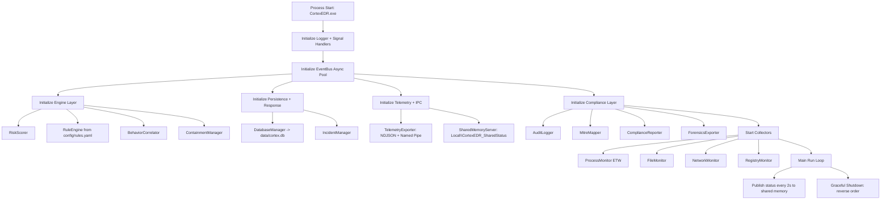
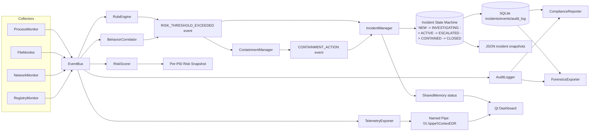

# CortexEDR

CortexEDR is a Windows-focused Endpoint Detection & Response (EDR) prototype implemented in C++20 with an optional Qt6 dashboard. It combines real-time telemetry collection, event-driven detection, incident lifecycle management, containment workflows, persistence, and compliance/forensics reporting in a modular architecture.


## Executive Summary

- Language/runtime: C++20, native Windows APIs, Qt6 (GUI), SQLite3
- Build system: CMake (MSVC toolchain)
- Detection model: event-driven risk scoring + rule matching + behavioral correlation
- Response model: incident state machine + containment actions (manual-safe default)
- Persistence model: SQLite WAL + JSON incident snapshots
- Compliance model: tamper-evident audit chain (HMAC-SHA256), MITRE ATT&CK mapping, PCI-DSS/HIPAA/SOC2 reports, forensics package export

## Architecture Overview

### High-Level Components

- `core/`: EventBus, ThreadPool, Logger, Windows header compatibility layer
- `collectors/`: Process (ETW), File system, Network socket table polling, Registry key monitoring
- `engine/`: `RiskScorer`, `RuleEngine`, `BehaviorCorrelator`
- `response/`: `IncidentManager`, `ContainmentManager`
- `persistence/`: `DatabaseManager` (SQLite schema, prepared statements, snapshots)
- `ipc/`: shared memory status server/client + named pipe client
- `compliance/`: `AuditLogger`, `MitreMapper`, `ComplianceReporter`, `ForensicsExporter`
- `ui/`: Qt dashboard and bridge (`EDRBridge`, `IPCWorker`, panel modules)
- `tests/`: unit + integration tests (EventBus, IPC, risk, incidents, DB, compliance)

### Runtime Orchestration Diagram



### Event Processing and Incident Lifecycle Diagram



## Code-Accurate Behavior Notes

- `main.cpp` initializes modules in phases and starts/stops components in strict order.
- Event fan-out uses `EventBus` with async publish support (`InitAsyncPool(2)`).
- The engine loop updates shared memory status every 2 seconds for GUI status cards.
- `ContainmentManager` is initialized in manual-safe mode in current code path:
  - `auto_contain = false`
  - `require_confirmation = true`
- `IncidentManager` serializes incidents both to JSON files (`incidents/`) and SQLite when DB is configured.
- `DatabaseManager` enables SQLite WAL mode and provisions tables:
  - `events`
  - `incidents`
  - `audit_log`

## Repository Layout

```text
CortexEDR/
├── core/
├── collectors/
├── engine/
├── response/
├── persistence/
├── ipc/
├── compliance/
├── ui/
├── tests/
├── config/
├── data/
├── main.cpp
├── main_gui.cpp
└── CMakeLists.txt
```

## Build and Toolchain

### Prerequisites

- Windows 10/11 x64
- Visual Studio 2022 (Desktop development with C++)
- CMake 3.20+
- vcpkg
- Qt6 (MSVC 2022 64-bit) for GUI builds
- Administrator privileges for ETW-backed process collection

### Third-Party Dependencies

Install with `vcpkg`:

```powershell
vcpkg install yaml-cpp:x64-windows nlohmann-json:x64-windows spdlog:x64-windows gtest:x64-windows openssl:x64-windows sqlite3:x64-windows
```

### Configure

```powershell
cmake -B build -S . `
  -DCMAKE_TOOLCHAIN_FILE=C:\vcpkg\scripts\buildsystems\vcpkg.cmake `
  -DCMAKE_PREFIX_PATH="C:\Qt\6.10.2\msvc2022_64" `
  -DBUILD_GUI=ON
```

### Build

```powershell
cmake --build build --config Debug
```

Expected targets:

- `CortexEDR` (console engine)
- `CortexEDR_GUI` (Qt dashboard, when Qt6 is found)
- `cortex_tests` (test executable)

## Runbook

### 1) Start backend engine (Administrator shell)

```powershell
.\build\Debug\CortexEDR.exe
```

### 2) Start GUI (optional)

```powershell
.\build\Debug\CortexEDR_GUI.exe
```

The GUI consumes:

- shared memory status: `Local\CortexEDR_SharedStatus`
- event pipe stream: `\\.\pipe\CortexEDR`

### 3) Run tests

```powershell
.\build\Debug\cortex_tests.exe
ctest --test-dir build -C Debug --output-on-failure
```

## Configuration

Primary config files:

- `config/config.yaml`
- `config/rules.yaml`

Key configurable domains in `config/config.yaml`:

- logging
- risk thresholds/weights
- file/network/registry monitoring settings
- response policy and quarantine path
- telemetry export + named pipe
- persistence DB path
- IPC shared memory name
- compliance audit/reporting/forensics settings

## Data and Output Artifacts

- Log file: `logs/cortex.log`
- SQLite database: `data/cortex.db`
- Incident snapshots: `incidents/*.json`
- Telemetry export (when enabled): `telemetry/events.ndjson`
- Forensics packages: output directory configured under `compliance.forensics`
- Compliance reports: output directory configured under `compliance.reporting`

## Quality and Test Coverage

The test suite includes:

- core infra: EventBus, ThreadPool
- engine: RiskScorer
- response: IncidentManager
- persistence: DatabaseManager
- IPC: shared memory + named pipe flows
- integration: end-to-end bridge behavior
- compliance/reporting/export workflows

## Known Build Caveat in Current Snapshot

`CMakeLists.txt`, `main.cpp`, and tests reference `telemetry/TelemetryExporter.*`, but the `telemetry/` directory is not present in this repository snapshot. If your local checkout has the telemetry module, build normally. If not, restore those files (or adjust CMake/targets) before compiling.

## Troubleshooting

- ETW access denied: run backend in Administrator shell.
- Qt6 not discovered: verify `CMAKE_PREFIX_PATH` points to the installed Qt6 MSVC kit.
- Named pipe/shared memory disconnected in GUI: ensure backend is running and names match `config/config.yaml`.
- Existing ETW kernel session conflict:

```powershell
logman stop "NT Kernel Logger" -ets
```

## Security and Scope Notice

This is a prototype and educational/security-engineering project. It is not production-hardened and should not be deployed as an enterprise endpoint security control without substantial hardening, threat-model validation, and operational safeguards.

## License

MIT
